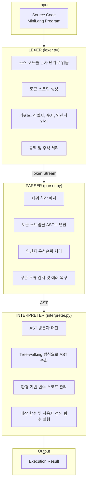

# MiniLang 프로젝트 보고서

## 컴파일러 구현 프로젝트

---

# 1. 언어 개요 및 설계 의도

## 1.1 프로젝트 소개

**MiniLang**은 교육 목적으로 설계된 간단한 인터프리터 언어입니다. Python으로 구현되었으며, 컴파일러/인터프리터의 핵심 개념을 학습하기 위해 개발되었습니다.

## 1.2 설계 목표

1. **학습 용이성**: 컴파일러의 핵심 구성 요소(Lexer, Parser, Interpreter)를 명확히 분리
2. **직관적 문법**: JavaScript/Python과 유사한 문법으로 쉬운 학습 곡선
3. **완전한 기능**: 실제 프로그래밍에 필요한 핵심 기능 모두 구현
4. **확장 가능성**: 모듈화된 구조로 기능 추가 용이

## 1.3 언어 특징

| 특징 | 설명 |
|------|------|
| 타입 시스템 | 동적 타이핑 (Dynamic Typing) |
| 실행 방식 | AST 기반 인터프리터 (Tree-walking) |
| 패러다임 | 절차적 프로그래밍 |
| 스코프 | 렉시컬 스코프 (Lexical Scope) |

---

# 2. 구현된 언어 기능

## 2.1 데이터 타입

```
- Integer (정수): 42, -10, 0
- Float (실수): 3.14, -0.5
- String (문자열): "Hello", 'World'
- Boolean (불리언): true, false
- Null: null
- Array (배열): [1, 2, 3]
- Function (함수): func name() { }
```

## 2.2 변수 선언 및 대입

```javascript
let x = 10          // 변수 선언 및 초기화
let name = "Mini"   // 문자열 변수
let arr = [1, 2, 3] // 배열 변수
x = 20              // 재대입
x += 5              // 복합 대입 연산자
```

## 2.3 연산자

### 산술 연산자
| 연산자 | 설명 | 예시 |
|--------|------|------|
| + | 덧셈 / 문자열 연결 | 10 + 20, "a" + "b" |
| - | 뺄셈 | 20 - 10 |
| * | 곱셈 / 문자열 반복 | 3 * 4, "a" * 3 |
| / | 나눗셈 | 10 / 3 |
| % | 나머지 | 10 % 3 |
| ** | 거듭제곱 | 2 ** 10 |

### 비교 연산자
| 연산자 | 설명 |
|--------|------|
| == | 동등 |
| != | 부등 |
| < | 미만 |
| > | 초과 |
| <= | 이하 |
| >= | 이상 |

### 논리 연산자
| 연산자 | 설명 |
|--------|------|
| and | 논리 AND |
| or | 논리 OR |
| not | 논리 NOT |

### 복합 대입 연산자
```
+=, -=, *=, /=
```

## 2.4 조건문

```javascript
if condition {
    // then block
} else if condition2 {
    // else if block
} else {
    // else block
}
```

## 2.5 반복문

### While 문
```javascript
while condition {
    // body
}
```

### For 문 (C-style)
```javascript
for let i = 0; i < 10; i = i + 1 {
    // body
}
```

### 제어문
```javascript
break     // 반복문 탈출
continue  // 다음 반복으로
```

## 2.6 함수

```javascript
func add(a, b) {
    return a + b
}

// 재귀 함수
func factorial(n) {
    if n <= 1 { return 1 }
    return n * factorial(n - 1)
}
```

## 2.7 배열

```javascript
let arr = [1, 2, 3, 4, 5]
print(arr[0])        // 인덱스 접근
arr[1] = 99          // 인덱스 대입
push(arr, 6)         // 요소 추가
let last = pop(arr)  // 요소 제거
```

## 2.8 내장 함수

| 함수 | 설명 | 예시 |
|------|------|------|
| print(args...) | 출력 | print("Hello") |
| input(prompt) | 입력 | input("Name: ") |
| len(x) | 길이 | len([1,2,3]) → 3 |
| type(x) | 타입 | type(42) → "integer" |
| str(x) | 문자열 변환 | str(123) → "123" |
| int(x) | 정수 변환 | int("42") → 42 |
| float(x) | 실수 변환 | float(10) → 10.0 |
| abs(x) | 절대값 | abs(-5) → 5 |
| min(args...) | 최소값 | min(3,1,4) → 1 |
| max(args...) | 최대값 | max(3,1,4) → 4 |
| sqrt(x) | 제곱근 | sqrt(16) → 4.0 |
| floor(x) | 내림 | floor(3.7) → 3 |
| ceil(x) | 올림 | ceil(3.2) → 4 |
| push(arr, val) | 배열에 추가 | push(arr, 10) |
| pop(arr) | 배열에서 제거 | pop(arr) |
| range(...) | 범위 생성 | range(5) → [0,1,2,3,4] |

## 2.9 주석

```javascript
// 단일 행 주석
# 이것도 단일 행 주석

/* 다중 행
   주석 */
```

---

# 3. 문법 정의 (EBNF)

```ebnf
program        = { declaration } ;

declaration    = varDecl | funcDecl | statement ;

varDecl        = "let" IDENTIFIER [ "=" expression ] terminator ;

funcDecl       = "func" IDENTIFIER "(" [ parameters ] ")" block ;

parameters     = IDENTIFIER { "," IDENTIFIER } ;

statement      = exprStmt
               | ifStmt
               | whileStmt
               | forStmt
               | returnStmt
               | breakStmt
               | continueStmt
               | printStmt
               | block ;

exprStmt       = expression terminator ;

ifStmt         = "if" expression block [ "else" ( ifStmt | block ) ] ;

whileStmt      = "while" expression block ;

forStmt        = "for" [ varDecl | exprStmt ] ";" 
                 [ expression ] ";" [ expression ] block ;

returnStmt     = "return" [ expression ] terminator ;

breakStmt      = "break" terminator ;

continueStmt   = "continue" terminator ;

printStmt      = "print" "(" [ arguments ] ")" terminator ;

block          = "{" { declaration } "}" ;

expression     = assignment ;

assignment     = ( IDENTIFIER | arrayAccess ) 
                 ( "=" | "+=" | "-=" | "*=" | "/=" ) assignment
               | logicOr ;

logicOr        = logicAnd { "or" logicAnd } ;

logicAnd       = equality { "and" equality } ;

equality       = comparison { ( "==" | "!=" ) comparison } ;

comparison     = term { ( "<" | ">" | "<=" | ">=" ) term } ;

term           = factor { ( "+" | "-" ) factor } ;

factor         = power { ( "*" | "/" | "%" ) power } ;

power          = unary { "**" unary } ;

unary          = ( "-" | "not" | "!" ) unary | postfix ;

postfix        = primary { call | index } ;

call           = "(" [ arguments ] ")" ;

index          = "[" expression "]" ;

primary        = NUMBER | STRING | "true" | "false" | "null"
               | IDENTIFIER | "(" expression ")" | arrayLiteral ;

arrayLiteral   = "[" [ arguments ] "]" ;

arguments      = expression { "," expression } ;

terminator     = ";" | NEWLINE ;
```

---

# 4. 시스템 구조

## 4.1 전체 아키텍처



### 처리 흐름 요약

| 단계 | 컴포넌트 | 입력 | 출력 |
|------|----------|------|------|
| 1 | Lexer | Source Code | Token Stream |
| 2 | Parser | Token Stream | AST |
| 3 | Interpreter | AST | Execution Result |

## 4.2 모듈 구성

```
minilang/
├── src/
│   ├── tokens.py       # 토큰 타입 정의 (TokenType enum, Token class)
│   ├── lexer.py        # 어휘 분석기 (Lexer class)
│   ├── ast_nodes.py    # AST 노드 정의 (Expression, Statement classes)
│   ├── parser.py       # 구문 분석기 (Parser class)
│   ├── interpreter.py  # 인터프리터 (Interpreter class)
│   └── main.py         # 메인 실행 파일 (REPL, CLI)
├── tests/              # 테스트 프로그램 (12개)
├── examples/           # 예제 프로그램 (5개)
├── docs/               # 문서
└── README.md           # 프로젝트 설명
```

## 4.3 데이터 흐름

### 4.3.1 Lexer → Parser

```
Source: "let x = 10 + 20"
    ↓
Tokens: [
    Token(LET, "let"),
    Token(IDENTIFIER, "x"),
    Token(ASSIGN, "="),
    Token(INTEGER, 10),
    Token(PLUS, "+"),
    Token(INTEGER, 20),
    Token(EOF, None)
]
```

### 4.3.2 Parser → AST

```
Tokens → AST:

Program
└── VariableDeclaration
    ├── name: "x"
    └── initializer: BinaryOp
        ├── left: NumberLiteral(10)
        ├── operator: "+"
        └── right: NumberLiteral(20)
```

### 4.3.3 Interpreter 실행

```
AST → Execution:

1. Visit VariableDeclaration
2. Evaluate BinaryOp(10 + 20) = 30
3. Define variable "x" = 30 in environment
```

---

# 5. 구현 세부사항

## 5.1 토큰 정의 (tokens.py)

### TokenType Enum
- 리터럴: INTEGER, FLOAT, STRING, BOOLEAN
- 키워드: LET, IF, ELSE, WHILE, FOR, FUNC, RETURN, etc.
- 연산자: PLUS, MINUS, MULTIPLY, DIVIDE, EQ, NEQ, etc.
- 구분자: LPAREN, RPAREN, LBRACE, RBRACE, etc.

### Token 클래스
```python
@dataclass
class Token:
    type: TokenType
    value: Any
    line: int
    column: int
```

## 5.2 어휘 분석기 (lexer.py)

### 주요 기능
1. **문자 읽기**: 소스 코드를 한 문자씩 읽음
2. **토큰 인식**: 패턴 매칭으로 토큰 타입 결정
3. **위치 추적**: line, column 정보 유지
4. **오류 처리**: 잘못된 문자에 대한 에러 보고

### 처리 순서
1. 공백 건너뛰기
2. 주석 처리 (//, #, /* */)
3. 숫자 리터럴
4. 문자열 리터럴 (이스케이프 시퀀스 지원)
5. 식별자/키워드
6. 연산자
7. 구분자

## 5.3 구문 분석기 (parser.py)

### 파싱 방식
- **재귀 하강 파서** (Recursive Descent Parser)
- 각 문법 규칙에 대해 하나의 함수 구현

### 연산자 우선순위 (낮음 → 높음)
1. Assignment (=, +=, -=, *=, /=)
2. Logical OR (or)
3. Logical AND (and)
4. Equality (==, !=)
5. Comparison (<, >, <=, >=)
6. Additive (+, -)
7. Multiplicative (*, /, %)
8. Power (**)
9. Unary (-, not)
10. Postfix (함수 호출, 배열 접근)
11. Primary (리터럴, 식별자, 괄호)

### 에러 복구
- `synchronize()` 메서드로 다음 문장까지 건너뜀
- 여러 에러를 한 번에 보고

## 5.4 인터프리터 (interpreter.py)

### 실행 방식
- **Tree-walking Interpreter**
- AST 방문자 패턴 (Visitor Pattern) 사용

### 환경 (Environment)
```python
class Environment:
    def __init__(self, parent=None):
        self.variables = {}
        self.parent = parent
```
- 중첩 스코프 지원
- 클로저 구현

### 제어 흐름
- Return: `ReturnValue` 예외
- Break: `BreakException` 예외
- Continue: `ContinueException` 예외

---

# 6. 테스트 프로그램

## 6.1 테스트 목록

| 번호 | 파일명 | 테스트 내용 |
|------|--------|-------------|
| 01 | test01_variables.ml | 변수 선언, 산술 연산, 문자열 |
| 02 | test02_comparison.ml | 비교 연산자, 논리 연산자, 단락 평가 |
| 03 | test03_conditionals.ml | if/else/else-if, 중첩 조건문 |
| 04 | test04_while.ml | while 반복문, break, continue |
| 05 | test05_for.ml | for 반복문, 중첩 반복문 |
| 06 | test06_functions.ml | 함수 정의, 재귀, 클로저 |
| 07 | test07_arrays.ml | 배열 생성, 인덱싱, push/pop |
| 08 | test08_builtins.ml | 내장 함수 테스트 |
| 09 | test09_strings.ml | 문자열 연산, 인덱싱 |
| 10 | test10_scope.ml | 변수 스코프, 섀도잉 |
| 11 | test11_algorithms.ml | 정렬, 탐색, GCD 등 알고리즘 |
| 12 | test12_comprehensive.ml | 종합 테스트 |

## 6.2 예제 프로그램

| 파일명 | 설명 |
|--------|------|
| hello_world.ml | 기본 출력 |
| fibonacci.ml | 피보나치 수열 |
| fizzbuzz.ml | FizzBuzz 문제 |
| prime_numbers.ml | 소수 관련 함수들 |
| multiplication_table.ml | 구구단 |

---

# 7. 실행 방법

## 7.1 요구사항
- Python 3.8 이상
- 추가 의존성 없음

## 7.2 실행 명령어

```bash
# REPL 모드
python src/main.py

# 파일 실행
python src/main.py examples/fibonacci.ml

# 디버그 모드 (토큰, AST 출력)
python src/main.py -d examples/fibonacci.ml

# 토큰 확인
python src/main.py -t "let x = 10"

# AST 확인
python src/main.py -a "let x = 10"

# 직접 코드 실행
python src/main.py -c "print(1 + 2)"
```

---

# 8. 제한사항 및 향후 개선점

## 8.1 현재 제한사항

1. **클래스/객체**: 객체지향 기능 미지원
2. **모듈 시스템**: import/export 미지원
3. **예외 처리**: try/catch 미지원
4. **타입 시스템**: 정적 타입 검사 없음
5. **최적화**: 성능 최적화 미적용

## 8.2 향후 개선 방향

1. 클래스 및 객체 지원
2. 모듈 시스템 추가
3. 바이트코드 컴파일러 구현
4. 더 나은 에러 메시지
5. 디버거 기능

---

# 9. 결론

MiniLang 프로젝트는 컴파일러/인터프리터의 핵심 구성 요소를 직접 구현함으로써 프로그래밍 언어의 동작 원리를 깊이 이해할 수 있게 해주었습니다.

- **Lexer**: 소스 코드를 토큰화하는 과정 학습
- **Parser**: 문법 규칙과 AST 생성 이해
- **Interpreter**: 프로그램 실행과 스코프 관리 경험

총 6개의 소스 파일, 12개의 테스트 프로그램, 5개의 예제로 구성된 완전한 프로그래밍 언어 구현체입니다.

---

**작성일**: 2024년

**프로젝트**: 컴파일러 수업 프로젝트
